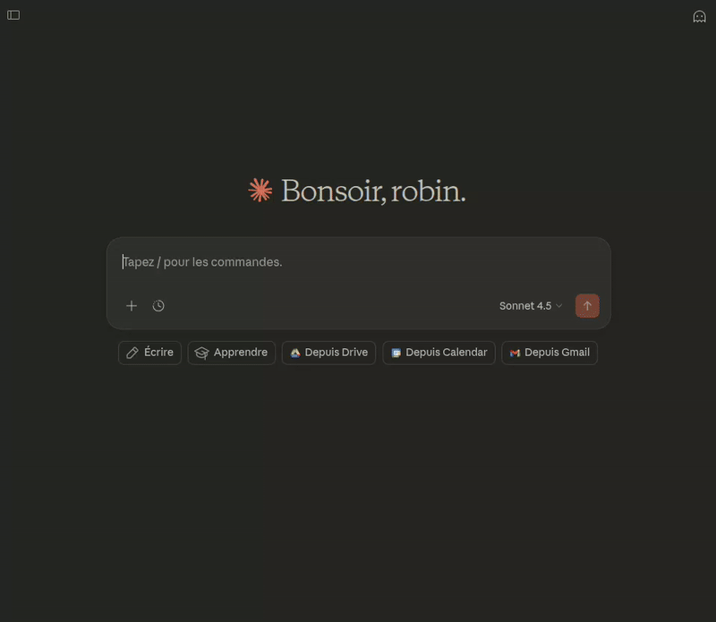

# Qarnot MCP Server

A FastMCP server for managing compute tasks on the [Qarnot Computing](https://qarnot.com) platform.

The goal was to exploring the how mcp works and how it can quickly be integrated to claude web through connectors: https://claude.ai/settings/connectors with a starting point of an OpenAPI json (from https://doc.tasq.qarnot.com/documentation/api/)

The test has been made with cloudfare to expose my local container over network tunneling.


## Demo

Using the Qarnot MCP server with Claude Web:



## Features

- **List Tasks**: View all compute tasks with status and progress
- **Get Task Details**: Retrieve detailed information about specific tasks
- **Submit Tasks**: Create and submit new compute tasks
- **Get Logs**: Retrieve stdout/stderr from task instances
- **Abort Tasks**: Stop running tasks
- **Delete Tasks**: Remove tasks from the system
- **Profile Management**: List and view available computation profiles

## Installation

### Using uv (recommended)

```bash
git clone https://github.com/your-org/qarnot-mcp.git
cd qarnot-mcp
uv sync
```

### Using pip

```bash
pip install -e .
```

## Configuration

Copy the example environment file and configure:

```bash
cp .env.example .env
```

Available environment variables:

| Variable | Default | Description |
|----------|---------|-------------|
| `QARNOT_BASE_URL` | `https://api.qarnot.com` | Qarnot API base URL |
| `QARNOT_API_VERSION` | `1` | API version |
| `LOG_LEVEL` | `INFO` | Logging level |

## Usage

### Running Locally

```bash
# Using uv
uv run python main.py

# Or directly
python main.py
```

The server will start on port 8000 with streamable-http transport.

### Using Docker

#### Production

```bash
docker compose -f docker-compose.prod.yml up -d
```

#### Local Development with Tunnel

For Claude Web access, use the local configuration with Cloudflare tunnel:

```bash
docker compose -f docker-compose.local.yml up
```

The tunnel URL will be displayed in the cloudflared container logs.

## Authentication

> **Note:** This is a proof of concept — no OAuth flow is implemented. The Qarnot API key is passed directly via HTTP headers. In a production setup, consider:
> - Adding an **OAuth gateway** in front of this server that exchanges OAuth tokens for Qarnot API credentials, or
> - Working with **Qarnot** to provide native OAuth support (e.g., OAuth 2.0 / OpenID Connect) so that MCP clients can authenticate without handling raw API keys.

The server requires a Qarnot API key for authentication. Provide it via .env file


## MCP Tools

### list_tasks

List all compute tasks for the authenticated user.

```json
{
  "tags": ["optional", "tag", "filter"]
}
```

### get_task

Get detailed information about a specific task.

```json
{
  "task_uuid": "task-uuid-here"
}
```

### submit_task

Submit a new compute task.

```json
{
  "name": "My Task",
  "profile": "docker-batch",
  "instance_count": 4,
  "resource_buckets": ["input-bucket"],
  "result_bucket": "output-bucket",
  "constants": [
    {"key": "DOCKER_CMD", "value": "python script.py"}
  ],
  "tags": ["my-project"]
}
```

### get_task_logs

Get stdout or stderr logs from a task.

```json
{
  "task_uuid": "task-uuid-here",
  "log_type": "stdout",
  "instance_id": 0
}
```

### abort_task

Abort a running task.

```json
{
  "task_uuid": "task-uuid-here"
}
```

### delete_task

Delete a task from the system.

```json
{
  "task_uuid": "task-uuid-here"
}
```

### list_profiles

List available computation profiles.

### get_profile

Get details of a specific profile.

```json
{
  "profile_name": "docker-batch"
}
```

## Development

### Running Tests

```bash
uv run pytest
```

### Running Tests with Coverage

```bash
uv run pytest --cov=src/qarnot_mcp
```

## License

MIT
